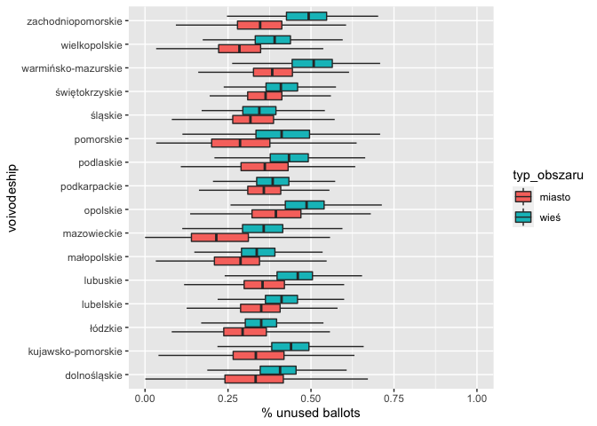

Wybory do Sejmu 2019: analiza metadanych z okręgów wyborczych
-------------------------------------------------------------

Dane źródłowe pobrane ze strony PKW:
<a href="https://sejmsenat2019.pkw.gov.pl/sejmsenat2019/pl/dane_w_arkuszach" class="uri">https://sejmsenat2019.pkw.gov.pl/sejmsenat2019/pl/dane_w_arkuszach</a>.

Liczba niewykorzystanych kart do głosowania

Ddd.
