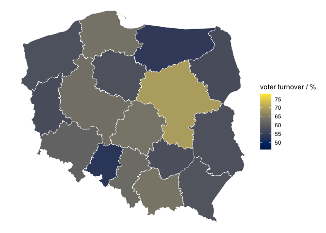
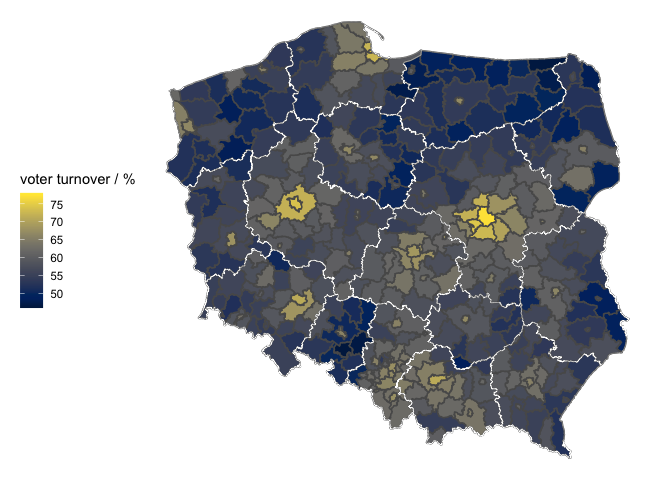
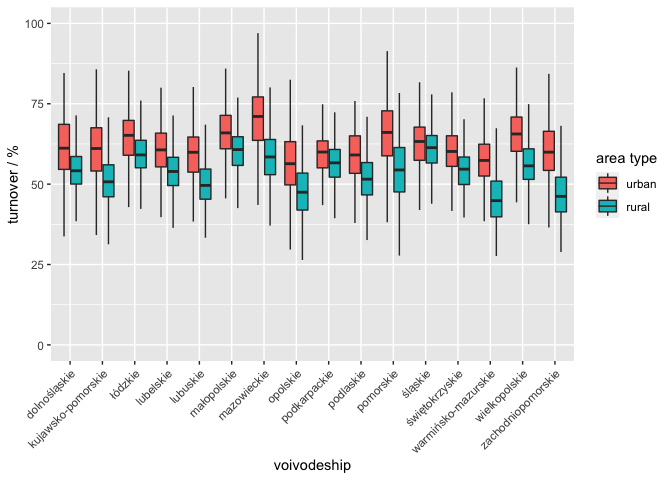
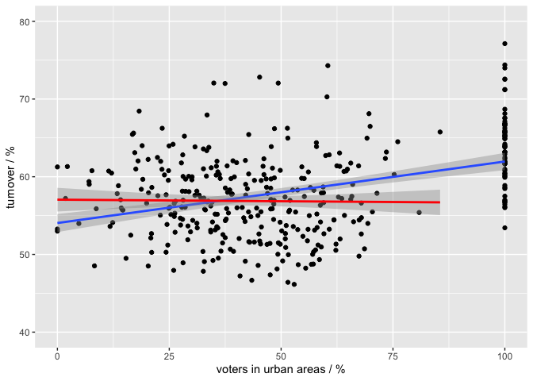
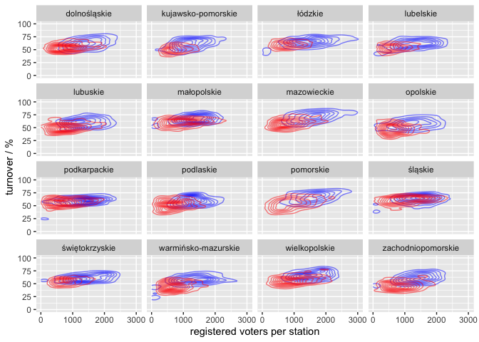
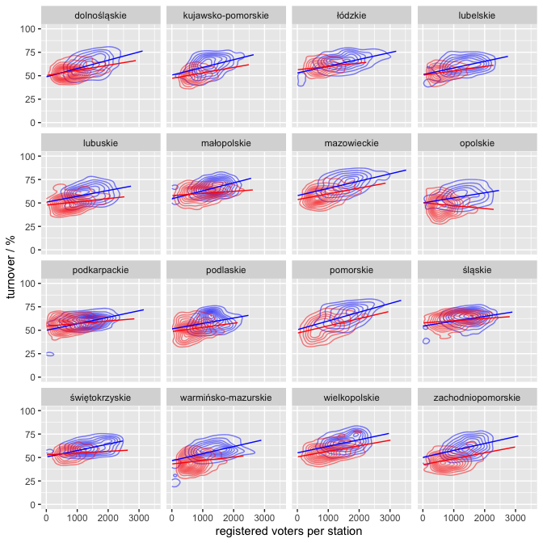

The Sejm elections in Poland in 2019
------------------------------------

### Voter turnover

One of the most common ways of displaying regional differences in the
voter turnover is displaying them by voivodeship, the first level of
administrative subdivisions.

This map reveals that the region with the highest turnover is Mazovia
\[pol. *mazowieckie*\], where the capital of Poland is located. The
other side of the spectrum is occupied by two peripherally located
regions: Opole \[pol. *opolskie*\] in southern Poland and Warmia-Masuria
\[pol. *warmińsko-mazurskie*\] in north-eastern part of the country.

More interesting patterns are, however, revealed by plotting the
turnover over powiats, the subdivisions of voivodeships.

One can appreciate the bright isles of high turnover, representing major
cities and surrounding urban areas. The map suggests that the
differences between the voivodeships are not necessarily driven by the
ration of rural to urban areas; clearly the peripheral regions of
Mazovia had higher voter turnout than corresponding areas of its
northern neighbor, Warmia-Masuria.

These differences can be shown by plotting the distribution of voter
turnovers on the single polling station level. I took the advanatge of
the fact that each station is assigned by the electoral commission with
‘urban’ or ‘rural’ category. Separating urban and rural areas within
each voivodeship gives insight into region-specific differences.

Generally speaking, in all voivodeships urban areas had higher turnover
than rural. This graph also shows quantitatively what we suspected in
the previous paragraph; the median turnover in rural Mazovia was higher
than in urban areas of Opole or Warmia-Masuria.

The same data subset can be looked at from a different perspective;
let’s see if there is correlation between the turnover and the fraction
of voters in urban areas on the powiat level.

There is a clear correlation if all powiats are considered (blue line),
but it seemed that it might be largely driven by the group of ‘100%
urban voters’ powiats, which belong in fact ‘cities with powiat rights’
– a special category of powiats. Excluding these points completely
changes the result (red line): the correlation is no longer observed.

One factor that might affect the willingness to vote is distance to the
closest polling station. Although I could not find a summary of areas
served by each of the polling stations, a reasonable approximation could
be achieved by calculating the average area served by a single polling
station for each powiat: powiat areas were pulled from the Polish
Wikipedia page.

This correlation is clear: the larger average area served by per polling
station on a powiat level, the lower the expected turnover.

Another interesting thing to look at is whether the size of a polling
station correlates with the voter turnover. We can suspect that the
polling stations serving more densely populated areas might be larger,
so let’s separate urban and rural areas, as well as voivodeships.

Well, our suspicion was correct; urban areas (blue) are typically served
by larger polling stations. However, the turnover difference between
urban and rural areas explains most of variability in the plot above.
The size of a polling station in rural areas does not seem to have a
significant effect on the expected turnover, maybe with the exception of
Mazovia and Pomerania \[pol. *pomorskie*\]
