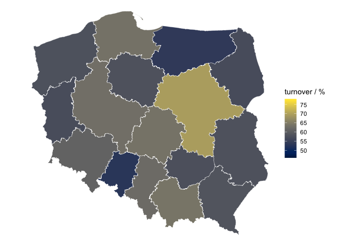

The Sejm elections in Poland, 2019
----------------------------------

### Voter turnover

By voivodeship

By powiat

Urban vs rural by voivodeship

    results_station_clean %>%
      filter(typ_obszaru %in% c("miasto", "wieś")) %>%
      ggplot(aes(x=wojewodztwo, y=(wydane_karty / wyborcow_uprawnionych * 100), fill = typ_obszaru)) +
      stat_boxplot(outlier.shape = NA) +
      labs(y="turnover / %", x="voivodeship") +
      scale_fill_discrete(name = "area type", labels = c("urban", "rural")) +
      theme(axis.text.x = element_text(angle = 45, hjust = 1))

