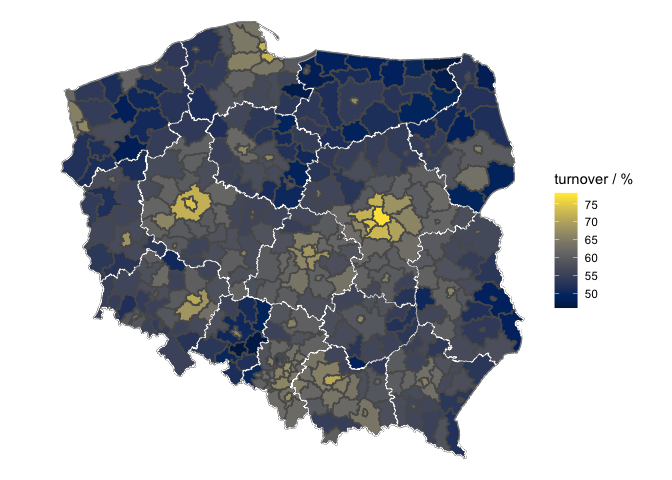

The Sejm elections in Poland, 2019
----------------------------------

### Voter turnover

By voivodeship

By powiat

Urban vs rural by voivodeship

    results_station_clean %>%
      filter(typ_obszaru %in% c("miasto", "wieś")) %>%
      ggplot(aes(x=wojewodztwo, y=(wydane_karty / wyborcow_uprawnionych * 100), fill = typ_obszaru)) +
      stat_boxplot(outlier.shape = NA) +
      labs(y="turnover / %", x="voivodeship") +
      scale_fill_discrete(name = "area type", labels = c("urban", "rural")) +
      theme(axis.text.x = element_text(angle = 45, hjust = 1))

By powiat density

    results_station_clean %>%
      filter(typ_obszaru %in% c("miasto", "wieś")) %>%
      group_by(powiat) %>%
      summarize(turnover = sum(wydane_karty) / sum(wyborcow_uprawnionych) * 100, n_stations = n(), n_voters = sum(wyborcow_uprawnionych), .groups = 'drop') %>%
      left_join(powiaty_table, by = "powiat") %>%
      mutate(area_perstation = powierzchnia / n_stations) %>%
      ggplot(aes(x = area_perstation, y = turnover)) +
        geom_point() +
        geom_smooth(formula = (y ~ x), method = 'lm') +
        labs(x = "area per station / km2", y = "turnover / %") +
        expand_limits(y = c(40,80))

By registered voters per station

    results_station_clean %>%
      filter(typ_obszaru %in% c("miasto", "wieś")) %>%
      ggplot(aes(x = wyborcow_uprawnionych, y = (wydane_karty / wyborcow_uprawnionych * 100))) +
        stat_density2d(data = results_station_clean[results_station_clean$typ_obszaru == "miasto",], color = "blue", alpha = 0.5) +
        stat_density2d(data = results_station_clean[results_station_clean$typ_obszaru == "wieś",], color = "red", alpha= 0.5) +
        labs(x = "registered voters per station", y = "turnover / %") +
        expand_limits(y = c(0,100)) +
        facet_wrap("wojewodztwo")

