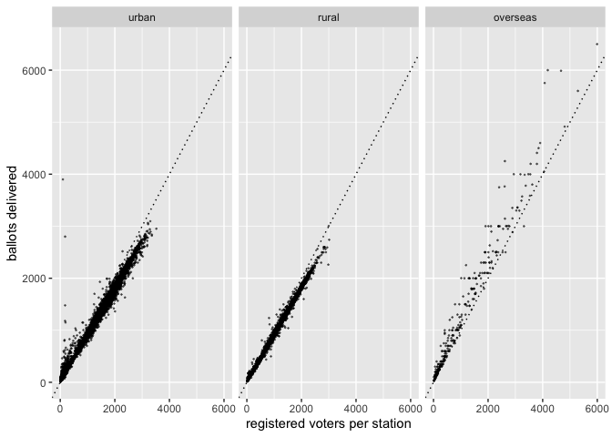
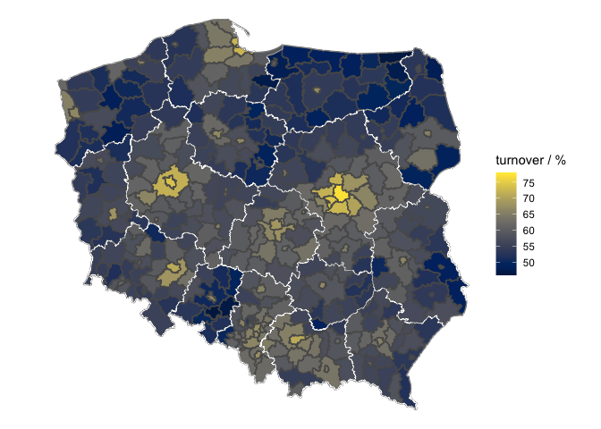

The Sejm elections in Poland in 2019
------------------------------------

### Voting metadata

Ballots received by polling stations by area type

This map reveals that the region with the highest turnover is Mazovia
\[pol. *mazowieckie*\], where the capital of Poland is located. The
other side of the spectrum is occupied by two peripherally located
regions: Opole \[pol. *opolskie*\] in southern Poland and Warmia-Masuria
\[pol. *warmińsko-mazurskie*\] in north-eastern part of the country.

More interesting patterns are, however, revealed by plotting the
turnover over powiats, the subdivisions of voivodeships.

One can appreciate the bright isles of high turnover, representing major
cities and surrounding urban areas. The map suggests that the
differences between the voivodeships are not necessarily driven by the
ratio of rural to urban areas; clearly the peripheral regions of Mazovia
had higher voter turnout than corresponding areas of its northern
neighbor, Warmia-Masuria.

These differences can be shown by plotting the distribution of voter
turnovers on the single polling station level. I took the advanatge of
the fact that each station is assigned by the electoral commission with
‘urban’ or ‘rural’ category. Separating urban and rural areas within
each voivodeship gives insight into region-specific differences.
